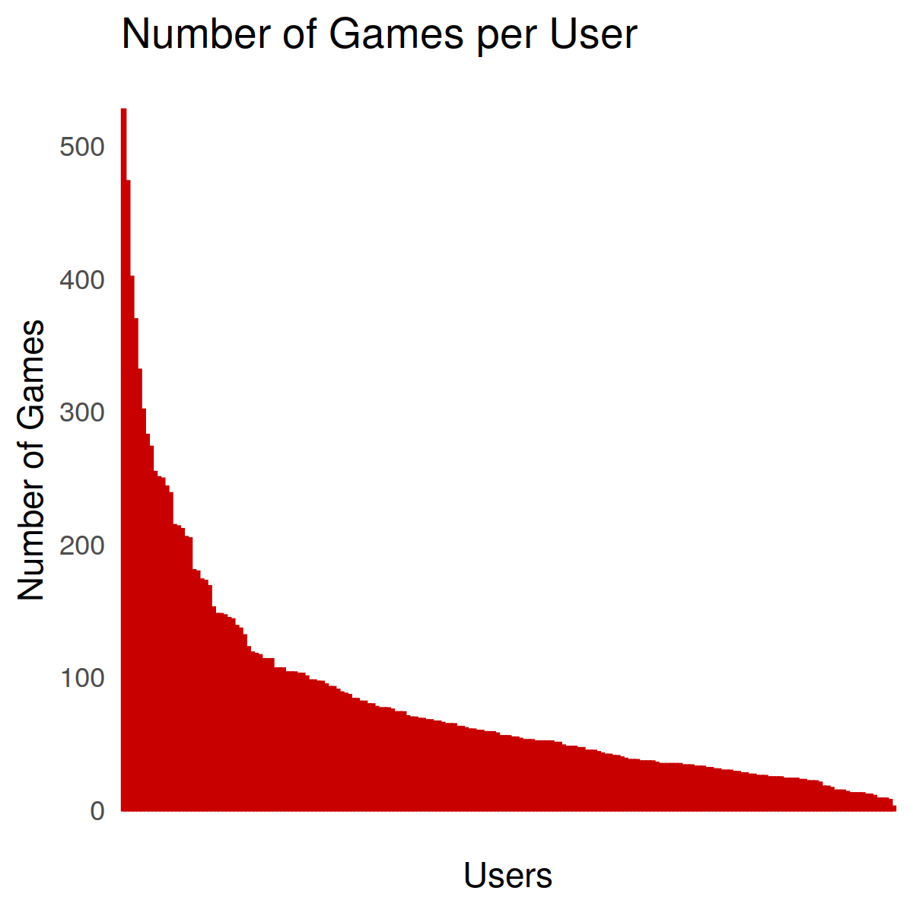
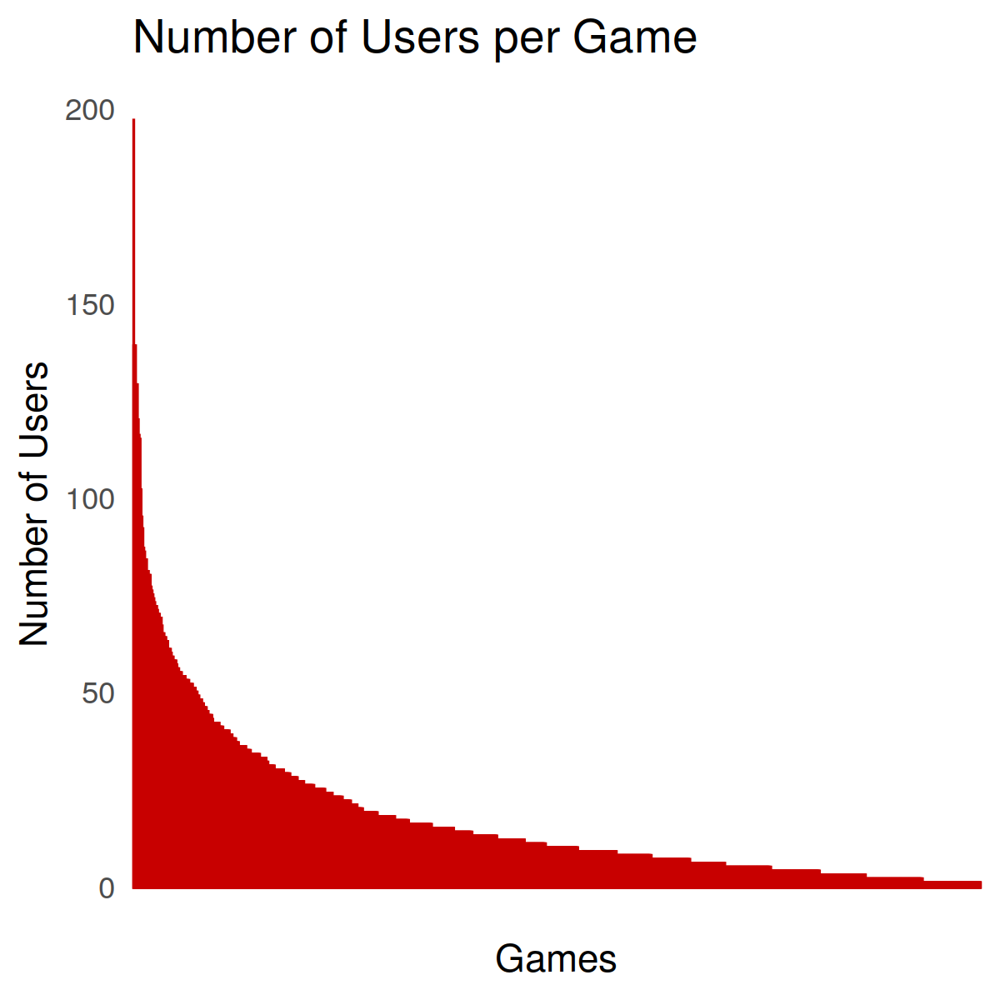
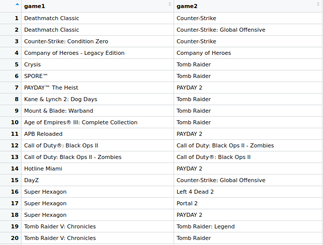
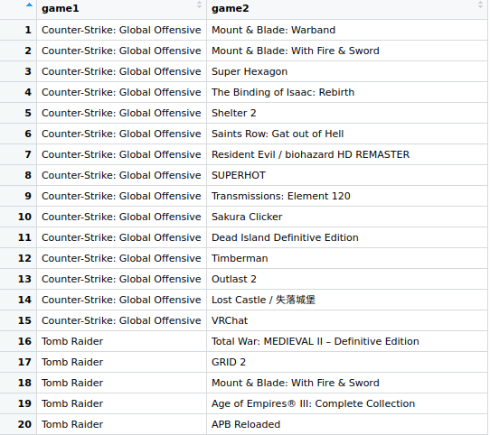

# Recommender System
## Data
The dataset is given in `data/test_set.csv`. It includes 2 columns with user ids and game ids, indicating which users possess which games.

## Getting game attribute information
Since recommender systems can greatly benefit from additional information about items, I extract game information from the Steam API. This includes attributes like category, developer, and genre. Note that I attached the full dataset already as `data/full_games.json`, since it takes a while to request all the information from the Steam API.

## Analysis
To have a better overview of the data, we want to investigate the dataset a bit more. We can see that we have only 199 users and 923 games, which does not seem like a representative sample of the gaming community. With 80 games per user, we see quite a lot of content per person, with some users having more than 400 games. Interestingly, each user owns the game _Rise of the Tomb Raider_ although it is not even for free. 
Here we can the distribution of games per user and users per game:



So we see that both distributions are following a power law: A few users own a lot of games, while the majority owns only a fraction of the top users and similarly only very few games are owned my the majority of users.

We can also check which games occur most frequently together (but excluding _Rise of the Tomb Raider_ since every user owns it anyways):


These all seem very reasonable, especially with so many pairs from the same franchise, e.g. _Counter-Strike_ and _Counter-Strike: Global Offensive_ or _PAYDAY The Heist_ and _PAYDAY 2_. Most of these games are also first person shooters or at least action games. Exceptions are _SPORE_ and also _Super Hexagon_, since these are not shooter games.

We can also have a look at those games that occur frequently in the dataset, but very rarely together:


We can see that players who have _Counter-Strike: Global Offensive_ rarely own one of these other games like _Mount & Blade_ or _Outlast 2_. This seems resonable, since the genres are fairly different. The same for _Tomb Raider_, where we can see that only few players own _Tomb Raider_ and strategy games like _Age of Empires_ or _Total War_ at the same time.

## Methods
There are quite a few possible methods that are commonly used for recommendations. Since it's not necessarily obvious from the beginning which one might be the best, I implemented and tested 3 of them.

### Popularity
This is the simplest method since it only creates a basic statistic of game popularity from the dataset, and then recommends the most popular games to any future users. 

### Item Similarity
This method is based on the idea that users will usually prefer games that are similar to those that they already like. Since we can determine similar games from the data that Steam provides through its API, we try to generate recommendations based on similar attributes like category, genre, developer, publisher, and platform. This is only a very basic baseline, though, since I did not do a lot of feature engineering and also did not optimize the matrix or train a classifier on it. Additionally, measuring the similarity is definitely more precise with cosine similarity, however, my implementation was too slow to evaluate it properly.

### Collaborative Filtering
Probably the most prominent method for recommendations which is based on user ratings and used by Netflix and Amazon. Essentially, recommendations for a user are generated by looking for users which enjoyed similar movies and games, and recommending their games which the new user hasn't tried yet. In the general case, no item attributes are used, but there are also hybrid solutions which integrate item information. We only concentrate on user-item interactions here, though. 

Based on the given dataset, we create a matrix which has as many rows as users and as many columns as games. For each cell `i`, `j`, the value is `1` if user `i` owns game `j` and otherwise 0. This could be extended if we had more specific ratings from a given user for a given game.

I implemented two approaches for collaborative filtering here. Both create two separate matrices with denser representations for games and users. The goal is to approximate the values from the original matrix with user ratings by multiplying these two matrices. However, they are significantly smaller, so the values need to be optimized to include dense representations of both entity types.

The first approach optimizes via a manual implementation of gradient descent (RecommenderMatrixFac), while the second one uses scikit-learn's `NMF` package which works in a very similar way.

### Evaluation Tests
It's not quite trivial to test the performance of a given recommender as it is e.g. for a simple binary classifier. Therefore, I used the following process:
1. We split the dataset by users, so that 80% of users are in the training set and 20% of users in the test set.
2. We train the recommender with interactions from users in the training set.
3. For evaluation, we iterate through users in the test set. For each user, we randomly remove `N` games from their game collection and let the recommender predict `K` games based on the remaining collection.
4. We then evaluate its success by checking which of the `N` games that were left out appear in the `K` recommended games.
Step 3 is repeated multiple times for each user, so that we have a more robust performance measure.

We calculate the precision, recall, and the f-score for each recommender: 
- Precision states how many `K` games were correct predictions for the user.
- Recall describes how many of the `N` games that were left out were correctly predicted.
- The f-score is simply a combination of the two measure by calculating the harmonic mean.

## Executing the script

## Results
The output from the evaluation script is the following, with `K` set to 10 and `N` set to 2, so that we try to predict 2 games and create 10 recommendations for that:
```
               Pop            ItemSim        MatFac         NMF            
Precision      6.25%          1.33%          8.26%          7.55%          
Recall         20.85%         4.45%          27.53%         25.17%         
F-score        9.62%          2.05%          12.71%         11.62%  
```
Surprisingly, the recommender only based on popularity counts is fairly decent. It seems to be a good baseline for the dataset, since the most popular games are owned by the majority of the users while less popular games occur only rarely. 

The recommender based on item similarity delivers poor results. This is understandable because it only uses few features without much preprocessing and a very basic similarity measure.

The two collaborative filtering approaches are most successful. Surprisingly, the manual implementation is even more successful than the one from scikit. 

## Future Work
All approaches (except the baseline popularity) are definitely still not optimized and there would be much potential to improve them. Especially when it comes to including more of the item attributes, since the genre could contain very valuable information for a recommender. 

The results from all approaches could also be easily combined with a linear regression classifier which takes the probabilities of the four methods and then makes a more robust decision. This would become an ensemble approach then and could theoretically be quite powerful since it could combine the strengths of the basic methods.

Deep learning approaches are also very popular and successful nowadays, so that one could e.g. create more sophisticated embeddings/representations for user and games. However, there is definitely not a lot of data in this dataset, so it is not an option for this task.